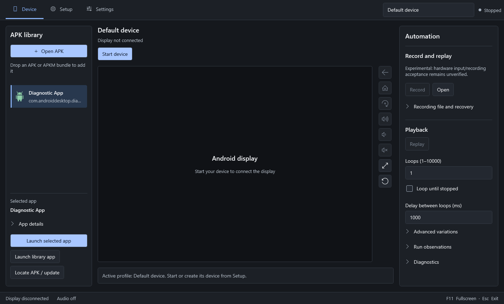
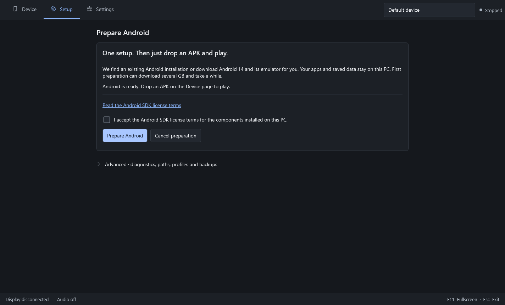
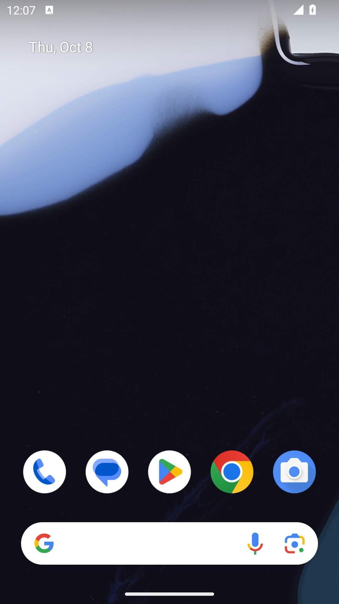
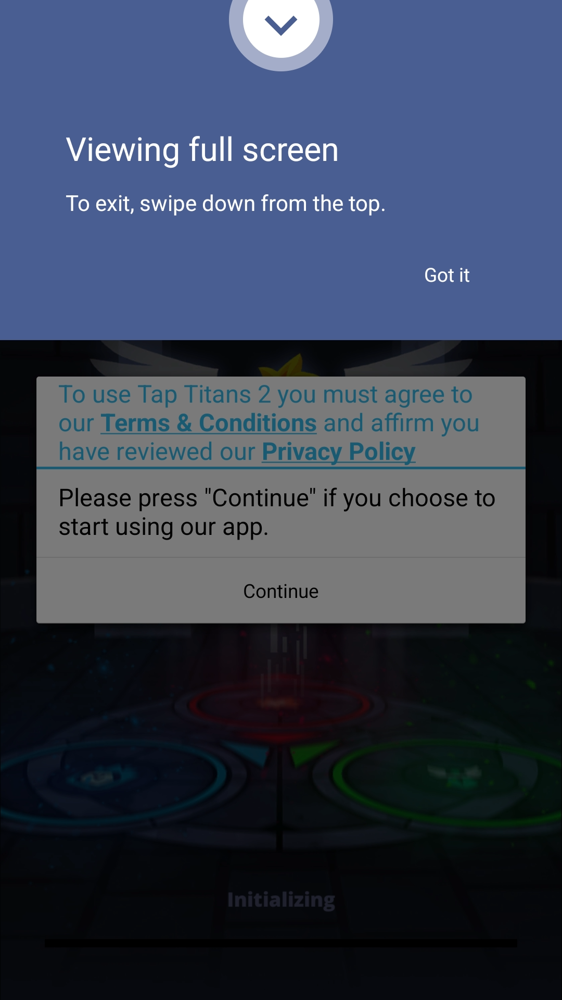

<div align="center">

# Android Desktop

**Open the app. Load Android. Drop in an APK.**

An Android emulator for Windows, with the device built into the app.


[Screenshots](#screenshots) · [Getting started](#getting-started) · [Build from source](#build-from-source) · [Current progress](#current-progress)

</div>



<p align="center"><sub>Graphite interface preview with sample library data. Real Android captures are shown below.</sub></p>

## Why I’m building this

I wanted to open an app, have Android ready in the viewport, and drop in a game. No hunting for SDK folders or filling in a page of paths just to get started.

That’s the experience I’m building here. A clean Windows app, readable text, straightforward controls, and an Android device that keeps your installed apps and saved data between sessions.

## What it does

| Feature | How it works |
| :--- | :--- |
| Automatic preparation | Finds an existing runtime or downloads the missing Android components after you accept the SDK terms. |
| Embedded Android | Boots the prepared device when the app opens and displays it in the main viewport. |
| APK and APKM import | Open or drop in an app. APKM bundles install the base APK and matching split files together. |
| App library | Keeps imported apps available to launch again, with a way to locate moved files or install an update. |
| Device controls | Back, Home, rotation, volume, optional audio and fullscreen. |
| Separate profiles | Each profile has its own Android storage and app library. One device runs at a time. |
| Backups and recovery | Device backup, verification, restoration and interrupted-restore recovery. |
| Record and replay | Experimental input recording, repeat loops and playback controls. |

## Screenshots

### First-time setup



One preparation action, progress updates, and the technical settings tucked away under Advanced.

### Android running in the viewport

<table>
  <tr>
    <th align="center">Android home</th>
    <th align="center">Tap Titans 2 · 8.3.0</th>
  </tr>
  <tr>
    <td align="center"></td>
    <td align="center"></td>
  </tr>
</table>

These are real frames captured from the embedded viewport. Tap Titans 2 installed from its original APKM bundle and reached its first-run terms screen. Gameplay hasn’t been verified yet.

## Getting started

1. Start Android Desktop.
2. If Android isn’t ready, open Setup, read the SDK terms, then choose **Prepare Android**. The app handles the downloads and device creation.
3. Once preparation finishes, the app returns to Device and loads Android in the viewport.
4. Use **Open APK** or drop an `.apk` or `.apkm` file onto the APK library. The app installs it and launches it.

For an APKM download, use the **original bundle**. Extracting only `base.apk` leaves out required split files.

First-time preparation needs internet access and at least **12 GB of free disk space**. Hardware virtualization must be enabled; some PCs also need Windows Hypervisor Platform enabled and a restart. After preparation, the app reuses its runtime and device.

Settings and device data are stored under `%LOCALAPPDATA%\AndroidDesktop`. Installation errors don’t trigger an automatic uninstall or device reset.

## Build from source

Use Windows x64 with the .NET SDK pinned in [global.json](global.json), Python 3.12, Node.js and pnpm. Visual Studio needs the **.NET desktop development** workload if you’re building through the IDE.

From the repository root:

```powershell
# Prepare the development gateway and build the viewport assets.
./scripts/Prepare-Phase0.ps1 -Python 'C:/path/to/python.exe' -PackageManager 'pnpm.cmd'

# Start the app.
dotnet run --project src/AndroidDesktop -c Release
```

The preparation script’s name comes from the original prototype. It prepares the current development dependencies. Android itself is prepared through the app’s Setup page.

For installer and self-contained builds, see the [build guide](docs/phase-3/BUILD.md). Existing installer artifacts may be behind the source; build the current checkout for the latest features.

## Current progress

Verified locally:

- Clean Debug and Release builds.
- **128 .NET tests** and **30 viewport tests** passing.
- Real Android boot, authenticated controller connection and visible viewport output.
- Tap Titans 2 **8.3.0** installed with its x86-64 split and launched to its first-run screen.

Still being tested:

- Gameplay compatibility, performance and long sessions.
- Saved-progress retention, backups and replay on real games.
- Fresh-PC installation and a complete first-time download run.

The current embedded display is limited to **15 fps**. Audio is optional and starts off. AAB, APKS, XAPK and separate OBB files aren’t supported. This is an active development project, not a finished release.

## Project notes

[Automatic setup](docs/AUTOMATIC_SETUP.md) · [APKM import](docs/APKM_IMPORT.md) · [Real APK testing](docs/REAL_APK_TEST.md) · [Design system](docs/design/DESIGN_MATRIX.md) · [Development history](docs/PROJECT_HISTORY.md)

Built with C#, .NET 10, WPF, WebView2, Google’s Android Emulator and a local Python gateway. Third-party components and notices are listed in [THIRD_PARTY_NOTICES.md](THIRD_PARTY_NOTICES.md). Public distribution and licensing review are still in progress.
